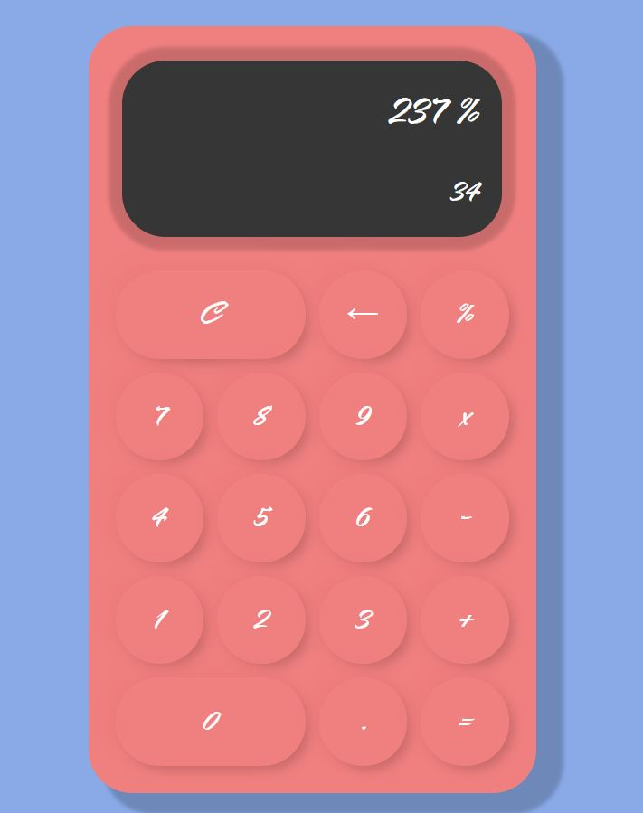

# js-calculator
Calculadora funcional usando html, css y js

Realiza las operaciones básicas de una calculadora.

**Preview:**

Página e idea inspirada en el tutorial de Programación Accesible [vídeo original](https://www.youtube.com/watch?v=7YDagj3cVAk&t=1918s&ab_channel=Programaci%C3%B3nAccesible)

**MUCHAS GRACIAS POR VISITAR EL REPOSITORIO**
